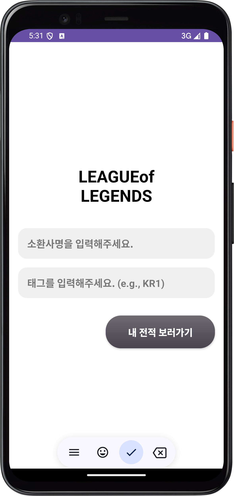
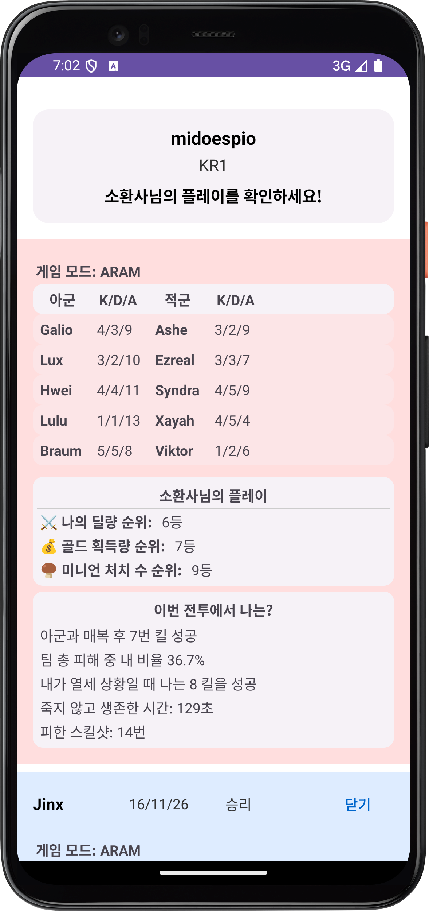

# 🖋️ LBook (롤북)
**Java Sdk Version** : minSdk = 24, targetSdk = 34

**실행 환경** : Pixel 4 API 35
## ✨ 어플 소개
안드로이드 스튜디오로 개발된 **LBook**은 리그 오브 레전드 플레이어가 자신의 전적을 손쉽게 확인할 수 있는 모바일 애플리케이션이다.
## 🎮 리그 오브 레전드?

리그 오브 레전드(League of Legends, LoL)는 미국의 라이엇 게임즈(Riot Games)가 개발한 멀티플레이어 온라인 배틀 아레나(MOBA) 장르의 게임이다. 2009년에 출시된 이후 세계적으로 높은 인기를 끌며 현재까지도 꾸준히 플레이어층을 유지하고 있는 대표적인 e스포츠 게임이다.

### ✚ 게임 소개
1. **플랫폼**: PC 기반 (Windows, macOS)
2. **장르**: MOBA (Multiplayer Online Battle Arena)
3. **모드**: 주로 5대5 팀 기반의 전략 게임
4. **목표**: 상대팀의 넥서스(기지)를 파괴하는 것이 최종 목표

🎮 게임에서 플레이어는 각기 다른 능력을 가진 챔피언을 선택하여 플레이하며, 2024년 기준으로 **160개 이상의 챔피언**이 있다.

---

## 🎮 롤북 실행하기
#### 1. **Riot Games Developer API Key 발급하기**  
   [Riot Games Developer Portal](https://developer.riotgames.com)에 접속하여 Riot 계정으로 로그인한 뒤, API 키를 발급받아야 한다.  
   - **API 키 발급 절차**:
     1. Riot 계정으로 로그인한다.
     2. "My Developer Applications" 섹션에서 프로젝트를 생성하거나 기존 프로젝트를 선택한다.
     3. "Development API Key"를 요청하여 발급받는다.
   - 발급받은 키는 테스트 및 개발 용도로 사용되며, 일정 시간이 지나면 만료된다.  
     상업적 목적으로 사용할 경우 **Production API Key**를 별도로 신청해야 한다.  
   - API 키는 개인 정보와도 관련이 있으므로 외부에 유출되지 않도록 주의해야 한다.

라이엇 API 무료 키는 24시간 후면 만료되는 키다.

해당 사이트에서 키를 복사한 후 안드로이드 스튜디오 프로젝트의
app/src/main/java/com/example/ai_lol_assistant/network/RiotApiClient.java에 위치한 
#### private static final String API_KEY = "#########"; // API key
이 곳에 발급받은 나의 키를 붙여넣는다.

---

## 🎮 LBook (롤북)을 실행하면?
LBook(롤북)을 처음 실행하면 소환사명과 태그를 입력할 수 있는 검색 창이 표시된다. 전적을 확인하고 싶은 소환사의 이름과 태그를 입력해 검색해보자.

 

### 🔎 검색하기

소환사 이름을 검색한 후, 아래와 같은 화면이 표시된다. 경기 결과는 승리 시 파란색, 패배 시 빨간색으로 구분되어 나타난다.

 

### 🔎 더보기

**"더보기"는 무엇일까?**  
"더보기" 버튼을 누르면 소환사의 더 자세한 전적을 확인할 수 있다.  

- **확인 가능한 정보**:
  - 아군과 적군의 챔피언 정보
  - 각 플레이어의 KDA(킬/데스/어시스트)
  - 나의 **딜량**, **골드 획득량**, **미니언 처치 수** 순위

특히, 해당 항목에서 1등을 차지하면 축하 메시지가 표시된다. 이를 통해 자신의 경기 기여도를 한눈에 확인할 수 있다.

   

## 🎮 마무리
#### 실제 앱을 실행해보면서 소환사의 전적을 확인해보자!

 

## ❤️ 도움 받았어요!
reference) ChatGPT
